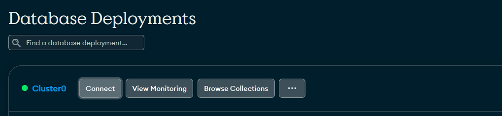
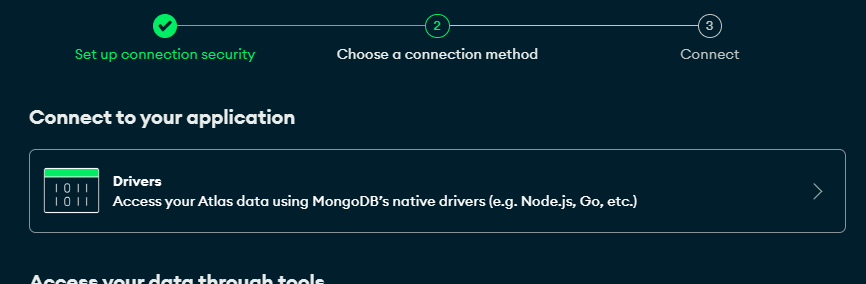
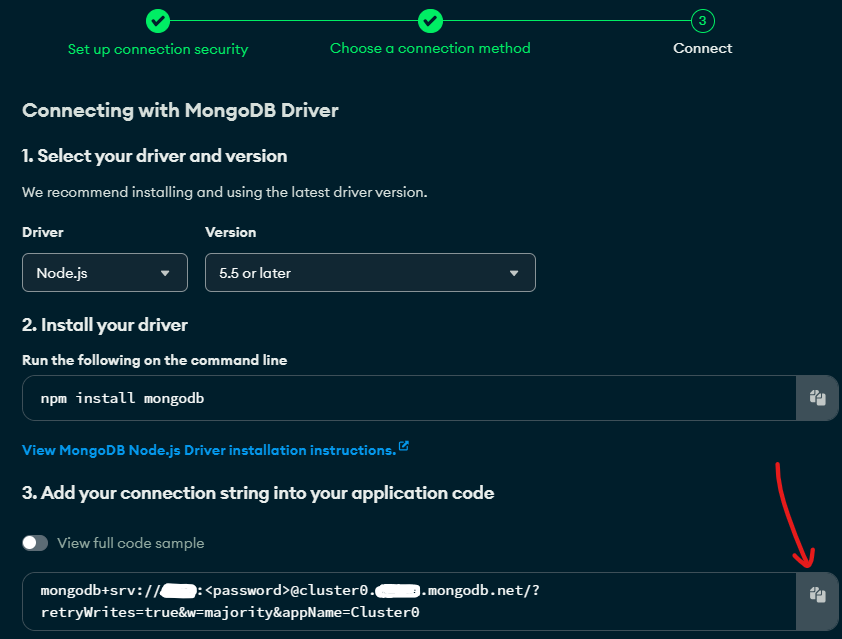

### A Next.js template

A Next.js app that uses Shadcn, Prisma ORM, MongoDB and Next Auth

[](https://vercel.com/new/clone?repository-url=https%3A%2F%2Fgithub.com%2Fdanybeltran%2Fnextjs-typescript-and-mongodb)

### Updating deps

To update the dependencies to their latest versions, run:

```
./scripts/update-deps.sh
```

---

### Development

You need to pass an env. variable with the MongoDB connection string, as well as any variables required by `next-auth`:

```
MONGO_URI=
NEXTAUTH_SECRET=
GOOGLE_APP_CLIENT_ID=
GOOGLE_APP_CLIENT_SECRET=
NEXTAUTH_URL=
```

How to get these variables?

---

- [`MONGO_URI`](https://www.mongodb.com/docs/manual/reference/connection-string/)

The connection string looks something like this:

`mongodb+srv://<user>:<password>@cluster0.<org>.mongodb.net/<database_name>?retryWrites=true&w=majority`

In your cluster, click **Connect**:



Under the **Connect your application** section, click **Drivers**:



Click the Copy button next to the connection string:



Replace `<password>` with the password for your user. Ensure any option params are [URL encoded](https://dochub.mongodb.org/core/atlas-url-encoding).

---

- [`GOOGLE_APP_CLIENT_ID` and `GOOGLE_APP_CLIENT_SECRET`](https://developers.google.com/identity/oauth2/web/guides/get-google-api-clientid)

---

Use your preferred tool to generate the `NEXTAUTH_SECRET` hash:

Using [This tool](https://generate-secret.vercel.app/32) is the quickest way to generate a hash. You can change the last segment of the url to get a hash of your preferred length, such as `https://generate-secret.vercel.app/44`

**OpenSSL :**

```bash
openssl rand -base64 32
```

**Urandom :**

```bash
head -c 32 /dev/urandom | base64
```

**Python :**

```py
import base64
import os

random_bytes = os.urandom(32)
base64_string = base64.b64encode(random_bytes).decode('utf-8')
print(base64_string)
```

**JavaScript :**

```js
const crypto = require('crypto')

const randomBytes = crypto.randomBytes(32)
const base64String = randomBytes.toString('base64')
console.log(base64String)
```

You can add those variables to a `.ENV` file (don't forget to add it to your `.gitignore` file!)

Related documentation:

- [`nextjs`](https://nextjs.org/docs)

- [`next-auth`](https://next-auth.js.org/getting-started/introduction)

- [`http-react`](https://httpr.vercel.app/docs)

[Live preview](https://nextjs-typescript-and-mongodb-psi.vercel.app)
